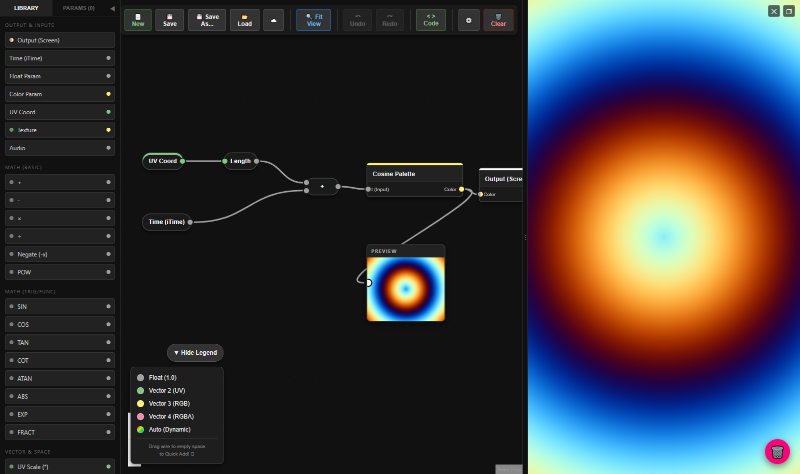
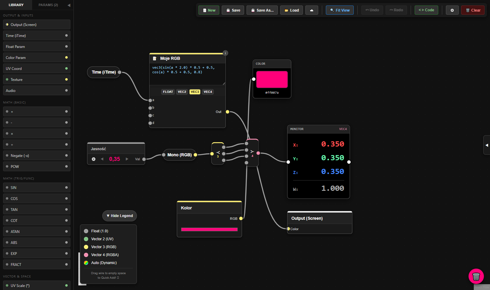
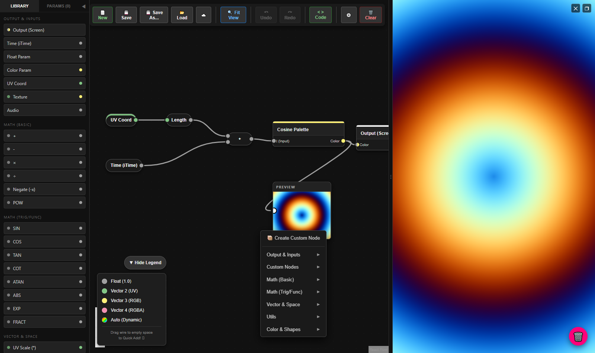
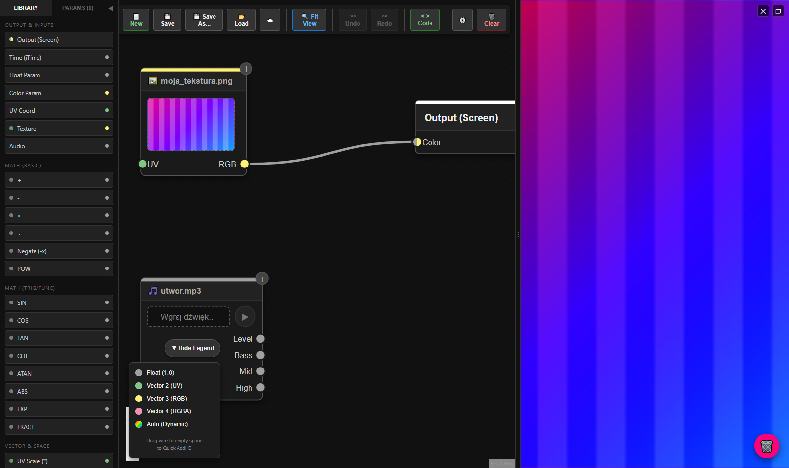
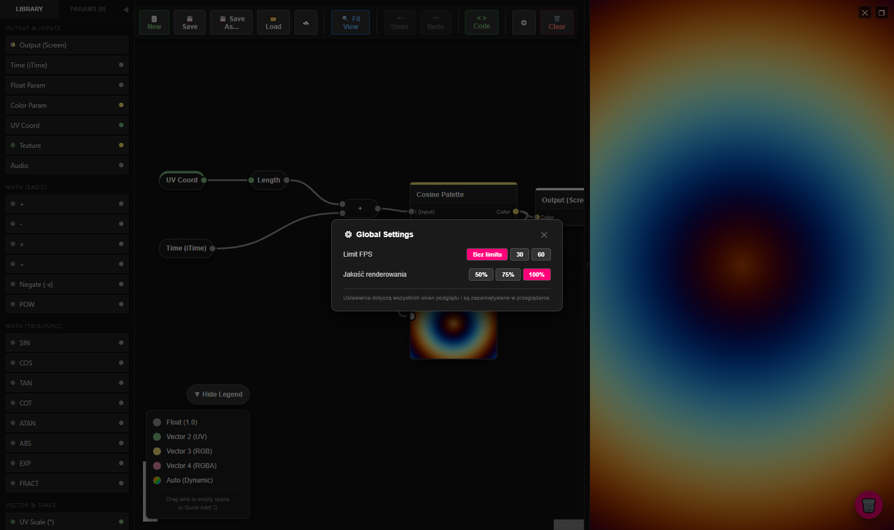
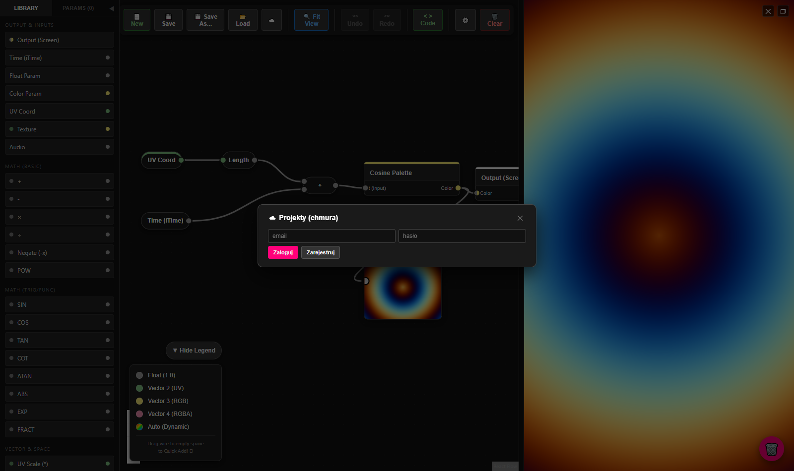

🇬🇧 **English** · [🇵🇱 Polski](README.pl.md)

# FlowShader

**A visual GLSL shader editor** — build graphics effects by wiring together
node blocks on a canvas, with the result rendering live right next to it.
No GLSL boilerplate to write: the graph compiles to a fragment shader
automatically on every change.



Above: the classic animated rings effect — `UV → Length → + Time → Cosine Palette → Output`.
Six blocks, zero lines of code.

## Quick start

```bash
npm install
npm run dev        # editor at http://localhost:5173
npm test           # ~630 tests (compiler, nodes, UI)
```

## What it's for

- **Learning shaders** — see live what each operation does; the `< > Code`
  panel shows the generated GLSL, so the graph doubles as an interactive
  textbook.
- **Prototyping effects** — backgrounds, audio visualizations, generative
  patterns; faster than hand-writing and reloading shaders.
- **Creative play** — tweak parameters (sliders, colors) while the animation
  is running.

## Core features

### Typed node graph with auto-adapters

Ports are typed (`float`, `vec2`, `vec3`, `vec4`) and color-coded. Incompatible
connections don't silently pass through — the **auto-adapter** inserts slim
Split (≺) / Combine (≻) nodes automatically to decompose and recompose
vectors:



Shown above:
- **Code (GLSL)** — a mini code editor: write an expression using inputs
  `a b c d` (e.g. `vec3(sin(a*2.0)*0.5+0.5, cos(a)*0.5+0.5, 0.8)`) and pick the
  output type,
- **Value Watcher** — live numeric readout of a signal (X/Y/Z/W),
- **Color Preview** — a color swatch with its hex code,
- slim **Split ≺ / Combine ≻** nodes with a vector-size badge,
- **Float Param** — a named parameter with arrows and a slider (the PARAMS
  tab in the library collects every parameter in the project in one place).

### Quick-add menu

Drag a wire onto empty canvas, or right-click — the menu shows **only nodes
that match the type** you're dragging. Selected nodes can also be saved as a
custom node (Create Custom Node) and reused like any other block:



### Textures and audio

The **Texture** node uploads an image from disk (with a thumbnail on the
node, plus an optional UV input), and **Audio** analyzes a sound file live
and exposes Level / Bass / Mid / High levels — ready to drive an animation
in time with music:



### Global settings

FPS limit (unlimited / 30 / 60) and render quality (50–100%) for every
preview window — useful on lower-end hardware:



### Saving projects

- **File**: `Save` overwrites the open file without prompting (like a
  regular editor), `Save As…` picks a new file, `Load` attaches the loaded
  file for subsequent saves. A project is plain JSON — easy to version in
  git.
- **Cloud** (optional, ☁️ button): sign-in, online projects with a per-user
  storage quota, and **sharing with a license** — a project can be private,
  "unlisted", or public, under ARR / CC BY / CC BY-NC / CC0. Backend setup
  (free Supabase tier): [SUPABASE_SETUP.md](SUPABASE_SETUP.md).



## Node library (overview)

| Category | Nodes |
|---|---|
| Inputs | Output (Screen), Time, Float/Color Param, UV Coord, **Texture**, **Audio** |
| Math | `+ − × ÷`, Negate, POW, SIN/COS/TAN/COT/ATAN, ABS, EXP, FRACT |
| Vector | UV Scale/Shift, Length, Fract (Vec2), Mix (Lerp), Relay |
| Utility | Split/Combine (Auto), Value Watcher, Preview, Color Preview, **Code (GLSL)**, Comment, Group |
| Simulation | **Frame Buffer**, **Sample Buffer** (multi-probe), Impulse, Random |
| Color & shapes | Cosine Palette, Add/Scale (Color), Mono (RGB), Circle SDF |
| Custom | Create Custom Node — wrap a piece of the graph into a reusable block with its own subgraph |

## More

- [ARCHITECTURE.md](ARCHITECTURE.md) — how the graph → GLSL compiler works
- [DEVELOPMENT.md](DEVELOPMENT.md) — working on the codebase
- [CLOUD_SYNC_DESIGN.md](CLOUD_SYNC_DESIGN.md) — cloud backend architecture
- Screenshots in this README are generated by `node scripts/docs-screenshots.mjs`
  (requires a dev server running on port 5199)

Stack: React 19 + TypeScript + Vite, React Flow (graph), Three.js (rendering),
Vitest + glslangValidator (GLSL correctness tests), Supabase (optional cloud).

## License

[PolyForm Strict 1.0.0](LICENSE) — the code can be viewed and run locally,
but not copied, modified, or reused in other projects without the author's
permission. (This applies to this repository — not to be confused with the
licenses users can attach to shader projects created *inside* the app,
described above in the Cloud section.)
